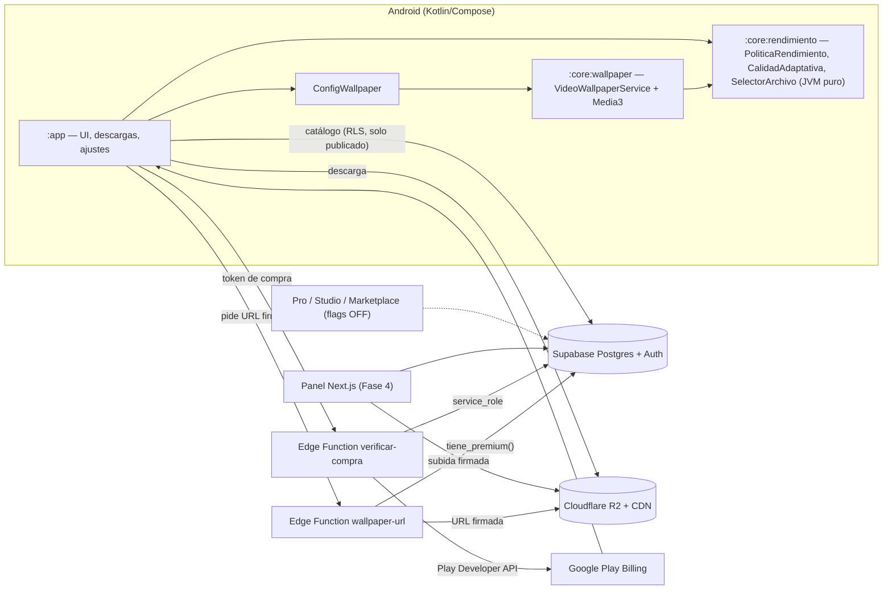

# Ilusión Pantalla — Fase 0: Descubrimiento

> **Tu pantalla cobra vida.** Estado: Fase 0 y base de Fase 1 entregadas. Ver "Qué está verificado" al final.

## 1. Resumen ejecutivo

Ilusión Pantalla empieza como una app Android de **wallpapers de vídeo en bucle**, optimizados y con modelo freemium, para validar demanda con el mínimo coste y riesgo. La misma plataforma (catálogo, cuentas, suscripciones, panel) alimenta después Mac, Studio IA, el módulo **Pro para inmobiliarias/escaparates** y un marketplace. La V1 no incluye 3D, audio, IA ni Pro: están **modelados en base de datos y desactivados con feature flags**, no programados.

**Hipótesis a validar con la V1** (decisión go/no-go a los 90 días): (1) ¿instalan y activan el wallpaper? (activación ≥ 40 % de instalaciones), (2) ¿qué categorías pesan? (¿arquitectura/casas de lujo arrastra a profesionales?), (3) ¿convierte a Premium? (objetivo inicial 2–4 % de activos), (4) ¿el coste de ancho de banda por usuario es sostenible?

## 2. Decisiones técnicas y suposiciones

| # | Decisión | Motivo / suposición |
|---|---|---|
| D1 | Vídeo en bucle (no 3D) en V1 | Más espectacular por euro y menos batería; el 3D llega tras validar. |
| D2 | Android nativo: Kotlin + Compose + Media3 | `WallpaperService` solo existe nativo. |
| D3 | Supabase (Postgres + Auth + RLS + Edge Functions) | Cumple RLS y esquema relacional del Pro. Firebase obligaría a rehacer permisos multiempresa. |
| D4 | Vídeos en **Cloudflare R2** (sin cargo de salida) + CDN | El ancho de banda es el coste dominante de esta app; R2 lo elimina. Supabase Storage solo para miniaturas/posters. |
| D5 | Vídeos **premium nunca públicos**: la app pide a la Edge Function `wallpaper-url` una URL firmada de corta vida tras verificar `tiene_premium()` | Un bucket público con URLs adivinables regala el catálogo premium. Ya protegido por RLS: `wallpaper_archivos` de premium no es legible por clientes. |
| D6 | Compras: Google Play Billing + **verificación del token en backend** (Play Developer API) → escribe `suscripciones` con `service_role` | El cliente no puede darse premium: probado (ver tests RLS). |
| D7 | Analítica: eventos propios en Postgres con consentimiento, o PostHog UE | Minimización RGPD; sin identificadores publicitarios. |
| D8 | Panel admin: Next.js + Tailwind en Fase 4 | Reutiliza el stack habitual de Pau. |
| D9 | Hilt, Room, Retrofit/Ktor, WorkManager se incorporan en Fase 2 al aparecer los casos de uso reales | Evita código muerto en la base; las versiones están en `libs.versions.toml`. |
| D10 | La **lógica de rendimiento es un módulo Kotlin puro** (`:core:rendimiento`) | Testeable en CI sin emulador; el servicio solo la consume. |

### Límites técnicos de Android que condicionan el producto (honestidad)

- **Inicio vs. bloqueo**: la API pública no permite fijar un *live wallpaper* solo en la pantalla de bloqueo; lo decide el sistema/fabricante en su pantalla de confirmación. La app lo explica; no lo promete.
- **Límite de FPS**: ExoPlayer no recorta fotogramas. El techo se aplica **eligiendo la variante de vídeo** (24/30/60 fps) y con `Surface.setFrameRate` como pista (API 30+). Por eso cada wallpaper se produce en varias variantes.
- **Pausa por juego/videollamada**: requiere el permiso especial *Acceso a uso* (`PACKAGE_USAGE_STATS`) y es sensible en Google Play. **No va en V1**: el campo `appExigenteEnPrimerPlano` existe en la política y está cubierto por test; se activa si hay demanda y el permiso supera la revisión.
- **Con el móvil bloqueado se pausa el render** (ahorro de batería): regla de producto ya implementada.
- **Audio**: `volume = 0` fijo. El sonido ambiental es Fase 6 con un flag.
- **Fabricantes con optimización agresiva** (Xiaomi, Huawei, etc.) pueden matar el servicio: hará falta una pantalla de ayuda. Se descubrirá en pruebas con dispositivos reales (Fase 3).

## 3. Riesgos

| Riesgo | Prob. | Impacto | Mitigación |
|---|---|---|---|
| Coste de ancho de banda | Alta | Alto | R2, variantes por calidad, HEVC, descarga una sola vez + caché con límite, Wi-Fi por defecto. |
| Derechos de los vídeos (IA / stock) | Media | **Crítico** | Solo contenido original; guardar en `licencia` y `creditos` la procedencia de cada pieza; revisar términos de uso comercial del generador usado. Sin marcas ni personas reconocibles. |
| Rechazo en Google Play (suscripciones, datos, wallpapers) | Media | Alto | Paywall transparente, Data Safety honesto, sin permisos sensibles, borrado de cuenta in-app. |
| Consumo de batería percibido | Media | Alto | Pausas por política, perfil Ahorro, 30 fps por defecto, medición con Battery Historian en Fase 3. |
| Fragmentación (decodificadores HEVC) | Media | Medio | `SelectorArchivo` descarta HEVC sin hardware y cae a H.264. |
| Mercado saturado de wallpapers | Alta | Medio | Diferenciar con calidad cinematográfica, arquitectura/casas de lujo y la vía Pro. |
| Competir con el tiempo de Pau (producto en paralelo a otros) | Alta | Alto | Alcance V1 mínimo; todo lo demás con flag. |

## 4. Roadmap

| Fase | Contenido | Resultado verificable |
|---|---|---|
| 0 | Descubrimiento (este documento) | Decisiones y riesgos acordados |
| **1 (base entregada)** | Monorepo, esquema BD + RLS + seed, catálogo de 40, tokens, módulo de rendimiento, esqueleto Android, CI | Migraciones y 17 tests de lógica pasan; falta compilar Android en Android Studio |
| 2 | Catálogo, búsqueda, detalle, favoritos, descargas, perfil, offline, analítica | App navegable contra Supabase real |
| 3 | Motor de wallpaper completo + pruebas en dispositivos | Aplicar, pausar, sobrevivir a reinicio en 5+ móviles |
| 4 | Billing + paywall + Edge Functions + panel Next.js | Primera suscripción verificada en pruebas internas de Play |
| 5 | Preparación Pro/IA: endpoints, feature flags, panel oculto | Sin activar al público |
| 6 | Audio, parallax, música reactiva, 3D, Studio, Mac, Pro, marketplace | Según métricas de la V1 |

## 5. Arquitectura

## 6. Herramientas

Android Studio + JDK 17, Gradle 8.14, Supabase CLI, Cloudflare R2, Play Console, FFmpeg (transcodificar variantes y comprobar bucle), un generador de vídeo con **licencia comercial confirmada**, Sentry (errores), PostHog UE o eventos propios, GitHub Actions.

## 7. Complejidad por módulo (relativa, 1 = trivial, 5 = muy alta)

| Módulo | Complejidad | Nota |
|---|---|---|
| Esquema BD + RLS | 3 | Hecho y probado |
| Catálogo + búsqueda + descargas | 3 | Caché con límite y reanudación |
| Motor de wallpaper | **5** | Ciclo de vida, fabricantes, batería: requiere dispositivos reales |
| Billing + verificación | 4 | Estados de suscripción (gracia, pausa, reembolso) |
| Panel admin | 3 | CRUD + subida firmada a R2 |
| Pipeline de contenido (bucle perfecto, variantes) | 4 | Es el verdadero cuello de botella del producto |
| Pro inmobiliario | 4 | Player offline + emparejamiento + programación |
| Studio IA | 4 | Costes y moderación |
| macOS | 4 | Proyecto aparte, Metal/AVFoundation |

## 8. Qué está verificado y qué no (esta sesión)

**Verificado ejecutando**: 3 migraciones aplicadas en Postgres 16 + seed (12 categorías, 40 wallpapers); 9 grupos de pruebas de seguridad RLS (no se puede uno auto-dar premium/admin, no hay fuga entre empresas, premium no legible, créditos ajenos protegidos); catálogo con 40 wallpapers validado por script; coherencia y contraste WCAG de los tokens; **17 tests unitarios** de la política de rendimiento (JVM).

**Escrito pero NO compilado** (no hay Android SDK en el entorno): `:core:wallpaper`, `:app` y `libs.versions.toml` (versiones sin contrastar). Primer paso del siguiente bloque: abrir `android/` en Android Studio, sincronizar y corregir lo que aparezca.

**Pendiente**: Edge Functions, panel Next.js, Billing, pantallas reales, Hilt/Room/Retrofit, política de privacidad y términos redactados por un profesional.
